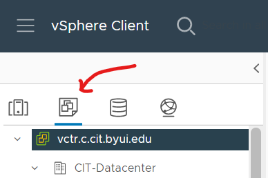
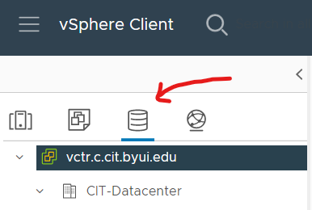
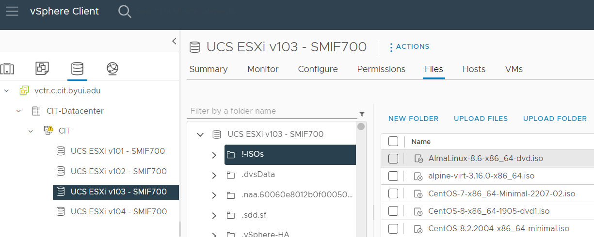
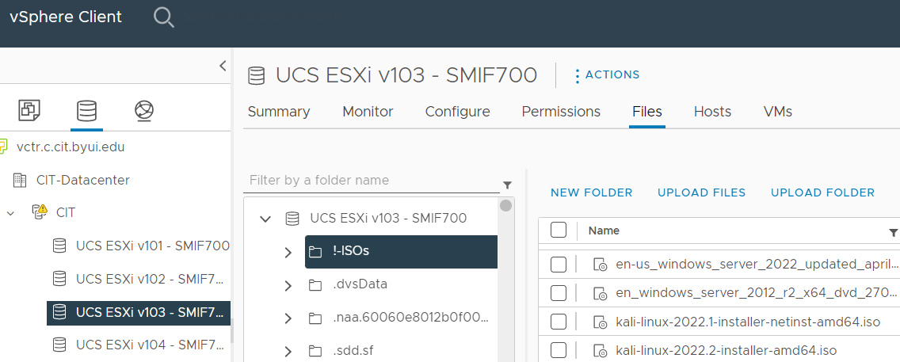

# Systems Security II
## Tools: CIT department VPN and VMware infrastructure

When they are enrolled in selected courses, students
manage virtual machines in a VMware infrastructure operated by the CIT department at BYU-Idaho.
Our VMware infrastructure integrates VMware's ESXi hypervisor software, vCenter server software, and vSphere management software
on clusters of enterprise-grade server hardware.

As a CIT 470 student, you will use vSphere to create and operate virtual servers.

### Required: Use GlobalProtect software to engage a VPN connection ###
VPN connection instructions are here:
<a
href="https://byui-cit.atlassian.net/wiki/spaces/CDI/pages/16351237/How+to+Install+VPN+Client+for+CIT+Firewall" target="_blank" ref="noopener">How to Install VPN Client for CIT Firewall</a>

### Required: Sign into CIT vSphere ###
*Note: vSphere is on a privately addressed server, so it is only available **after** you successfully engage your VPN conneciton.*

After you use GlobalProtect to connect to the department's VPN service, use your BYU-I credentials to log into the CIT department vSphere web interface:
<a href="https://vctr.c.cit.byui.edu/ui/" target="_blank" ref="noopener">https://vctr.c.cit.byui.edu/ui/</a>

From the 'hamburger' ( ≡ ) menu, select *Inventory*:

The panel you should see on the left side of the web interface has four pictographic icons at the top:
1. Hosts and Clusters
2. VMs and Templates
3. Storage
4. Networks

### Explore the VMs and Templates web user interface ###
Most of your work will happen under the second icon, VMs and Templates:

Expand the tree-list structure to find the CIT-470-Security folder, and within it, your team's subfolder.
This is where you and your teammates will deploy your virtual servers. You will also find a Templates subfolder.
This is where you will find a generic server template.

### Explore the Newtorks web user interfae ###
Select the fourth icon, Networks.
Then expand the tree-list structure to find and select the distributed virtual switch named **CIT_DSwitch**,
and select the Networks tab:

You should find a table that lists the virtual local area networks (VLANs) assigned to your team, along with their VLAN ID numbers.
Your should use these VLAN access numbers when you record "layer two" VLAN labels on your team's network diagrams.

### Explore the Storage web user interface ###
Select the third icon, Storage:

This shows the CIT department's storage-area-network (SAN) resources.
Expand the tree-list structure to find four storage containers, and select the one with **v103** in its name.
Then select the **Files** tab, and select the folder named **!-ISOs** (pronounced *bang-ISOs*):

You will see a collection of installation images for various operating systems.
The two Linux distributions we recommend for CIT 470 students are **AlmaLinux OS** version 8 and **Ubuntu Server** version 22.
Browse the collection and find the .iso installers for each of these.

- AlmaLinux OS uses Red Hat Packages (.rpm files) for software distribution and `dnf` ("dandified") for software package management.
  - If you or your teammates have more experience with Red Hat style distributions,
such as Red Hat Enterprise, Oracle Linux, CentOS, Fedora, Rocky, etc.
then AlmaLinux will feel familiar.
- Unbuntu Server uses Debian packages (.deb files) for software distribution and `apt` ("advanced package toolkit") for software package management.
  - If you or your teammates have experience with Debian style distributions,
such as Debian, Kali, Ubuntu, Raspberry Pi OS, Devuan, etc.
then Ubuntu Server will feel familiar.

>Your team doesn't have to use both Linux variants, but it's probably good for your career to maintain skills using both of the software package formats.
The *SELinux* (security enhanced Linux) activities in this course are designed for an AlmaLinux OS web server,
so it would be helpful for your team to deploy at least one such server.

Select the storage container with **v101** in its name.
Then select the folder named **!-ISOs**.

The Windows edition we recommend for CIT 470 students is **Windows Server 2022**; find its installation image file **Server2022Eval.iso**.
- A Windows Server evaluation license expires after 120 days.
(Fortunately, BYU-Idaho semesters are about 100 days long, so you won't need to worry about upgrading the license for this course.
But when you use Windows Server products later on in your career, you or your employer will need to purchase server licenses from Microsoft.)

