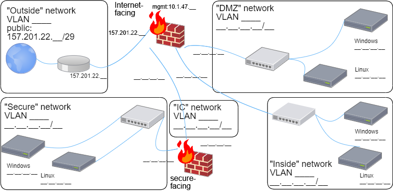
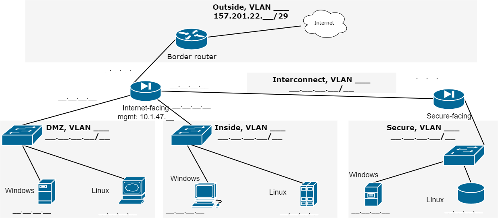

## Task: Diagram
Create and maintain a professional-quality network diagram that documents your team's security architecture.

## Software Tools
(Recommended) Here are some links to web-based applications students have successfully used to create their diagrams:
- <a href="https://www.office.com/launch/visio" target="_blank" ref="noopener">Microsoft Office Visio</a>
(sign in with your BYU-Idaho credentials to use the Visio web app)
- <a href="https://cacoo.com/" target="_blank" ref="noopener">Cacoo</a>
- <a href="https://www.lucidchart.com/pages" target="_blank" ref="noopener">Lucidchart</a>
- <a href="https://app.diagrams.net/" target="_blank" ref="noopener">diagrams.net</a>

(Optional) You may also install and use desktop workstation software to create a network diagram. Examples:
- Microsoft Visio. This is the premier diagramming tool used by industry network and security professionals.
It's a little challenging to learn, so Visio proficiency looks attractive on a job-seeker's résumé.
It is also expensive, but BYU-Idaho students may obtain a copy of Visio software at no cost:
  - Visit <a href="https://portal.azure.com/" target="_blank" ref="noopener">Microsoft Azure</a>.
  - Sign in with BYU-Idaho credentials.
  - Select "Explore" under "Access student benefits."
  - Select "Software" from the menu at the left of the Azure Education web page.
  - Select one of the available editions of Visio Professional.
  - Select **[Download]** to download the installer and **[View Key]** to obtain your product license activation key.
- <a href="https://www.yworks.com/products/yed" target="_blank" ref="noopener">yEd</a> (free download)
- <a href="https://wiki.gnome.org/Apps/Dia" target="_blank" ref="noopener">Dia</a> (free download)
- <a href="https://www.omnigroup.com/omnigraffle" target="_blank" ref="noopener">OmniGraffle</a> (This tool is for macOS users only, and is expensive, but has wide use among IT Professionals.)

(Not Recommended) It is possible to make network diagrams using general purpose drawing tools such as
Microsoft Paint, or Inkscape, or Adobe Illustrator, or GIMP, or the "Word Art" features in Microsoft Word/PowerPoint, or printing a Cisco Packet Tracer diagram.
Please don't use any of these for this task.

## Requirements
- Include four security zones in your network diagram:
  - **"secure"** (highest trust: sensitive assets will be deployed in this zone)
  - **"inside"** (ordinary trust: assets such as regular user's machines will be deployed here)
  - **"dmz"** (semi-trusted: assets that must be Internet-accessible will be deployed here)
  - **"outside"** (untrusted: alas, the rest of the Internet is not yours to create nor control)
    - (Also, it might be useful to specify a fifth **"interconnect"** utility zone between the firewalls.)
- Specify two firewalls as perimeter devices between your zones:
  - an Internet-facing firewall that will serve as the default router to the outside zone from both dmz and inside.
  - a secure-facing firewall that will be the default router from the secure zone.
- Specify at least two computer "end points" in the dmz, two in the inside zone, and two in the secure zone.
Your firewalls will enforce network security policies for various endpoint machines, such as the following:
  - Internet-facing hosts in the DMZ for web, proxy, and load balancing services
  - Protected hosts in the secure zone for database and network monitoring services
  - Regular hosts in the inside zone for testing and operating the services deployed in the other zones
- Leave room in your diagram to add some annotations later. In future assignments, you will annotate your diagram to include OSI-model layer information:
  - Layer 2 information: VLAN tags
  - Layer 3 information: IP addresses, subnet masks, and network identifiers
  - Layer 4 information: port numbers
  - Layer 7 information: application identifiers

## Deliverable
Upload an image, in either PDF or PNG file format, of your completed diagram.

## Scores
- If your diagram satisfies every requirement outlined above, you will earn a passing score (one point).
- If your diagram does not satisfy any one of the above requirements, you will earn earn no points.
You must then address any deficiencies and re-upload corrected diagrams until you earn the passing score.

## Examples
Here are some example diagram templates that were created using some of the tools mentioned above.
(Notice most of the important information is left blank. Your team must "fill-in-the-blanks"
with relevant information as the semester progresses, but you should already have the relevant
information you need to fill in at least some of the details.)

Example drawn using Microsoft Visio:

Example drawn using Cacoo:

Example drawn using diagrams.net:

Example drawn using Lucidchart:

